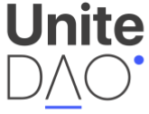
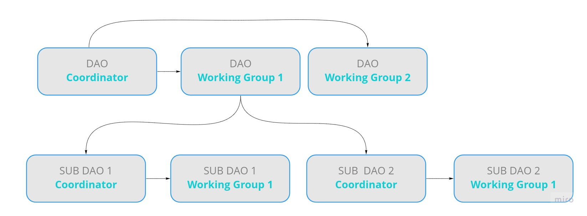
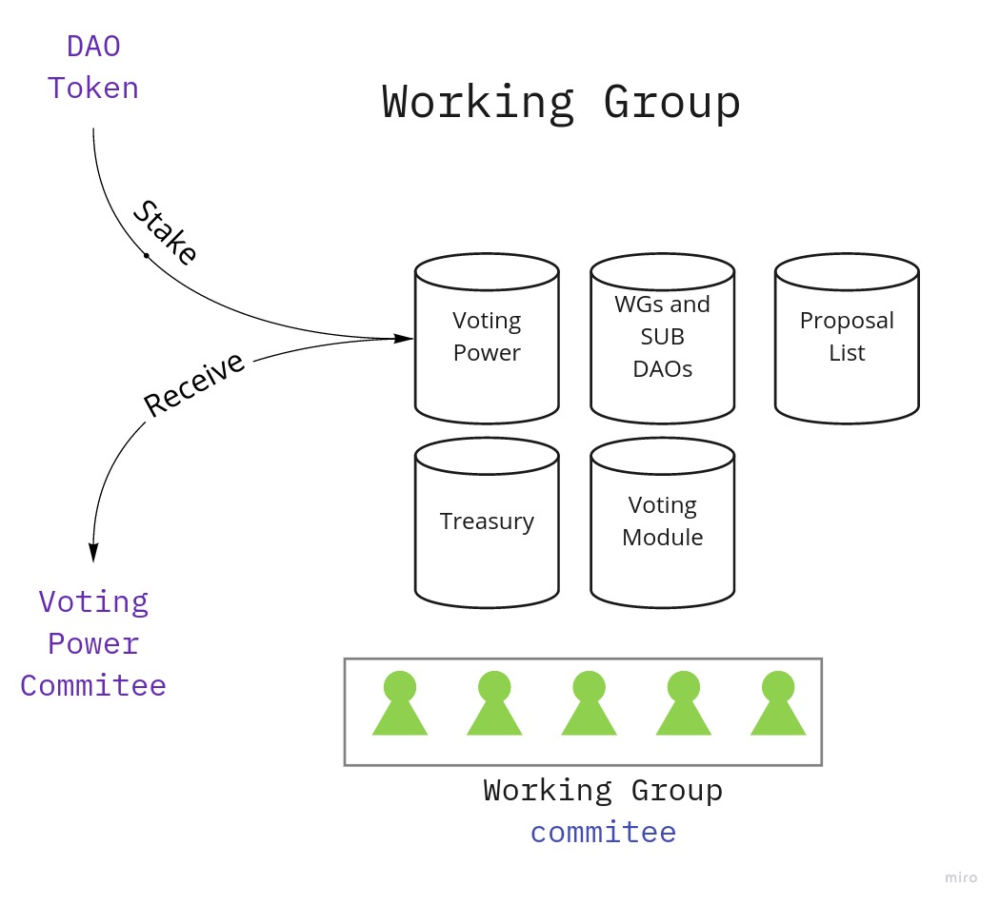

# Index

Work in Progress:
- [ ] (DAO Structure)[./contents/structure.md]
- [ ] (Technology Stack)[./contents/technology.md]
- [ ] (Tokenomics)[./contents/tokenomics.md]
- [ ] (Building Community)[./contents/community.md]
- [./contents/legal.md] and (Ethics)[./contents/ethics.md]

# Problem Statement
Web3 is growing fast, but we still lack a proper way to verify organizations. At the institutional level, we have a combination of CAs, Qualified Digital Signature, and Standardization Bodies (ISO, UNE…). All of these traditional institutions are usually agencies with no transparency, no interoperability, and no modern tools to develop applications on top of them.
 
In the traditional Identity Landscape, Trust is achieved by centralization and protection of already existing players. Innovation is always slow and limited to a small set of participants.
 
On the other hand, DAOs are becoming more popular and gaining traction as a transparent and efficient way of achieving consensus on different aspects of Society.
 
# Self-Sovereign Digital Identity (SSDI)
Self-Sovereign Digital Identity is built upon public-key cryptography and blockchain technologies, making it possible to independently publish and verify the identity of individuals, organizations, and their devices, without the involvement of a trusted intermediary (traditionally, a certificate authority). This can provide effective resistance to censorship, manipulation of data, and mass surveillance by eliminating the necessity of trusted third parties. The use of a public blockchain is necessary to make distributed identity possible.
 
Instead of trusting certificate authorities and centralized identity registries to hold the keys, Self-Sovereign Digital Identity allows users to keep their own private keys and their data private, and build a set of attestations or proofs about their identity, to which they can control access. They can even avoid sharing the actual data, and instead use zero-knowledge proofs to demonstrate that certain facts about them are true (e.g. proof of age, residency, nationality) without sharing their personally identifiable information.
 
Verifiable Credentials are a part of our daily lives; driver's licenses are used to assert that we are capable of operating a motor vehicle, university degrees can be used to assert our level of education, and government-issued passports enable us to travel between countries. This specification provides a mechanism to express these sorts of credentials on the Web in a way that is cryptographically secure, privacy-respecting, and machine-verifiable.
 
## Why is SSI not working?
Even though there are many great initiatives in SSI, we still lack a common language for Verifiable Credentials to be completely interoperable. We still need a trusted mechanism to decide on how these credentials are created, and how they evolve. We need coordination in the management of standards, and also on how power is distributed in the issuance of credentials. Who can issue what is still a missing link in the SSI ecosystem?
 
## Certificate Authorities and the Problem of Trust on the Internet
From Wikipedia: In cryptography, a certificate authority or certification authority (CA) is an entity that issues digital certificates. A digital certificate certifies the ownership of a public key by the named subject of the certificate. This allows others (relying parties) to rely upon signatures or on assertions made about the private key that corresponds to the certified public key. A CA acts as a trusted third party—trusted both by the subject (owner) of the certificate and by the party relying upon the certificate. The format of these certificates is specified by the X.509 or EMV standard.
 
Trust on the Internet has come to rely almost exclusively on a selected group of institutions serving as trusted third parties to issue digital certificates. While the system works well enough for most relations with the public administration, it still suffers from the inherent weaknesses of the trust-based model.
 
# Unite DAO
All the tools to achieve Trustless Interoperability are within our grasp — we just need to bring them together in a digital-first institutional design.

Unite DAO is a coordination framework to elaborate and evolve standards. It is based on three principles: Coordination, Verification, and Automation
 
- Coordination: Community-driven mechanisms to propose, refine, and evolve standards.
- Verification: Reputational Digital Identity for Organisations. Who they are, and what they can do.
- Automation: On-chain and off-chain issuance, verification, and revocation of credentials

Unite DAO will have a Guild sub-structure (Working Groups), where specific topics are discussed, refined, proposed, and developed. At every level it will have a Coordinator and Guilds. The Coordinator is responsible for creating and allocating resources to Guilds.
Every Guild can create a new sub-Guild with a Coordinator and more Guilds, in case that particular Guild needs to scale.

To participate in a Guild, participants need to stake the UniteDAO Token to get Voting Power, and so, be an active part of the Guild.
Every Guild will have an elected commitee with two main roles.

The process:
1. Someone with Voting Power for that Guild will send a proposal : new standard, evolve standard, trusted operators...
2. The proposal needs to be passed by the Commitee (threshold)
3. Then the proposal goes to voting (voting period). Only Voting Power in that Guild can vote.
4. When the proposal is approved, the commitee has a few days to stop it (bigger threshold).

### Step 1: Coordination
Cooperation is not possible without a common language we all agree on. Building this common framework should be a coordination task. That's why a DAO is a perfect instrument for that.
 
Also, Standards should be created by those using them, with Skin in the Game, not from remote offices by professional politicians who may be far removed from their use in the real world.
 
To achieve that we need to create coordination working groups to focus on:
- Protocols
- Metaverse & NFTs
- Compliance (security)
- DeFi
 
It's getting more important every day to verify that a Smart Contract has been issued by the correct organization, that it has already been audited by a known company, verified in the DAO and allowed to issue a -Security TAG, and that the company works at the highest level of security constrains.
Also, financial information could help take better decisions (even automated) on Risk Management and/or Investment opportunities. A verified company, with the right to isse these TAGs, could verify the TVL and/or the APY of another contract as a TAG
 
**And Many more**
DAO Governance, NFT applications, Local commerce....
 
### Step 2: Verification
Verifiable Credentials, once identified as standards themselves, must be issued to organizations, but once again, we need coordination in the verification of participants in the DAO.
- Verification Process
- Staking & Online Court
 
**Verification Process**
Trusted Organizations will claim their right to issue certificates on a particular standard by participating in the standard and by proposing themselves as trusted operators for that credential. Every Working group will have a WhiteList with the TRusted Operators for every standard coordinated in that WG. 
 
**Staking**
In order to become a TRsuted Operator, x number of tokens need to be staked to that particular WG. Slashing may occur when there's a bad issuance of certificates. We will rely in Kleros for this discussions.
 
### Step 3 : Automation
Step Three: who can issue every standard
 
Finally, we arrive at the end of this awesome journey. Thanks to the coordination and the verification that UNIT DAO provides the working groups will also be in charge of automation processes.
What do we mean by automation? Well, that's a very good question. When we talk about automation we are referring to multiple meanings.
 
An example of this could be the automatization of protocols and DAOs verifications. Let's say a DeFi platform wants to get verified, but, verified on what?  Smart contract auditions, front end security, enough decentralization. The list could go on...
 
We need an automated process in order to speed up and facilitate the issuance of certificates and verifications. And not letting bad players enter, the TO will receive rewards in the form of CAELUM tokens.
 
# Introduction to Unite DAO Tokenomics

## Unite DAO essence
When we take a look into Unite DAO structure and functions we can notice that the final goal is to create the first council’s framework within the decentralized ecosystem to enable the continuous creation and evolution of standards.
 
That sounds pretty cool but when it comes to coordinating people and organizations everything turns into a complete mess.
 
We can not base a whole project only on good human behavior and altruism to develop and expand decetralized ecosystem.
 
This is the reason for Unite DAO tokenomics. 
 
## Tokenomics
Unite DAO tokenomics aims to answer two main questions with a mathematical reliable approach:
 
The first one is, how do we maintain and guarantee a sustainable and effective decentralization of voting power?
The second one, how do we keep Unite DAO community engaged and incentivized?
 
Those two questions must be answered taking in mind one thing, Fides organic value increases over time.
 
## Treasury location
If we take a look into FIDE distribution we can observe that most of FIDE tokens will be minted within the DAO treasury.
 
Thanks to this amount of capital we aim to be self-sustainaible. That means we are looking to generate a capital increase over time, which will allow the development and evolution of UNIT DAO.
 
In order to achieve this goal multiple tokenomic theories had been analyzed and synthesized. We are focusing on a way to increase the investment value at the same time that we bankroll the ecosystem develpoment.
 
## FIDE Token
The FIDE Token is a Governance Token.
Fide is Unite DAO governance token.
 
When we explain what it Fide we could say it's something more than the simple tokenization of voting power.
 
That means that each FIDE gives voting power to its holder. During the first stages of Unite DAO, that voting power will be useable at the 4 main frameworks mentioned before.
 
That means that Fide Token Holders will be the ones who vote for candidates to become part of the working groups.
 
Those working groups will eventually determine and create the standards that will be applied to the whole ecosystem framework.
 
# Roadmap
### December 2021 Incorporation
- [x] Incorporation of newCo - SLU (owned by Alfa Caeli Spain)

### March 2022 Token Bootstrapping Event
- [ ] 50MM Fides at 0,05$. newCo distribute funds to the companies involved in the launching of the DAO.
- [ ] The newCo signs a MoU with the companies that will start the DAO, which must include a clause covering liability in case of errors

### April 2022 DAO Incorporation
- [ ] The DAO gets incorporated
- [ ] UniteDAO Alfa goes online.
- [ ] newCo closes operations, company is liquidated
- [ ] At this point the company in Spain exists no more, only the DAO manages the treasury through proposals.

### March 2022 Public Sale - Whitelisted
- [ ] The DAO does the Public Sale - Whitelisted
- [ ] Funds go to the treasury of the DAO
- [ ] To participate in the Public Sale, a verification process is performed.

### April 2022 Public Sale - Open
- [ ] The DAO does the Public Sale - Open
- [ ] Funds go to the treasury of the DAO

